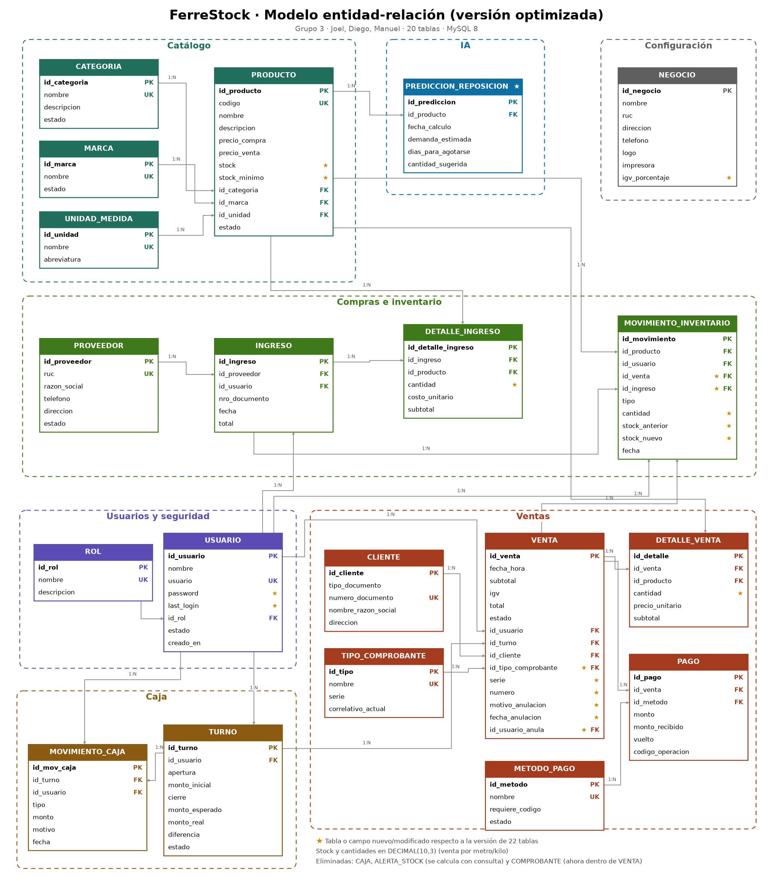

# FerreStock

Sistema web y móvil de **punto de venta (POS) e inventario** para una ferretería en Perú: ventas con IGV 18 %, pagos con Efectivo, Yape y Plin, boletas y facturas, control de stock, cierre de caja, reportes y predicción de reposición con IA.

Proyecto Integrador · 4.º ciclo · **Tecsup** · Diseño y Desarrollo de Software · 2026-2

| Integrante | Rol Scrum |
|---|---|
| Juan Diego Ramos Enriquez | Product Owner |
| Manuel Gerardo Salazar Ambrosio | Scrum Master |
| Joel Facundo Quijada Zevallos | Equipo de desarrollo |

Cursos que integra: Construcción y Pruebas de Software · Desarrollo de Aplicaciones Web · Desarrollo de Aplicaciones Empresariales · Programación en Móviles.

---

## 1. Arquitectura

```
 ADMINISTRACIÓN
 React admin ──── REST + JWT ────► Django ──────────────┐
                                    (dueño del esquema) │
                                                        ├──► MySQL 8 (20 tablas)
 USUARIO                                                │
 POS React  ──┐                                         │
              ├── REST + JWT ────► Spring Boot ─────────┘
 App Kotlin ──┘                    (solo valida las tablas)
```

| Componente | Tecnología | Usuarios | Curso |
|---|---|---|---|
| `admin-backend-django` | Django 6.1 + Django REST Framework | — | Desarrollo de Aplicaciones Web |
| `admin-frontend-react` | React 19 + Vite | Administrador y dueño | Desarrollo de Aplicaciones Web |
| `pos-backend-springboot` | Spring Boot 4.1 + Java 21 | — | Desarrollo de Aplicaciones Empresariales |
| `pos-frontend-react` | React 19 + Vite | Cajero | Desarrollo de Aplicaciones Empresariales |
| `app-movil-kotlin` | Kotlin + Jetpack Compose | Vendedor en tienda | Programación en Móviles |
| Base de datos | MySQL 8 | — | Todos |

**Reglas de la arquitectura**

- **Una sola base de datos** (MySQL 8) para todo el sistema.
- **Django es el dueño del esquema:** solo sus migraciones crean o modifican tablas. Spring Boot usa `ddl-auto=validate`, así que solo verifica que existan.
- **Login único:** Django emite el token JWT; Spring Boot lo valida con el mismo secreto. El rol del usuario viaja dentro del token.
- **Quién escribe qué:** Django → usuarios, catálogo, ingresos de mercadería, negocio e IA. Spring Boot → ventas, pagos, turnos y movimientos de caja.
- **Stock:** todo cambio va dentro de una transacción, con bloqueo de fila (`SELECT … FOR UPDATE`) y registro en el kárdex.
- **La app Kotlin nunca se conecta directo a MySQL:** todo lo pide a Spring Boot.

---

## 2. Estructura del repositorio

```
FerreStock/
├── README.md
├── .gitignore
│
├── database/
│   └── diagrama-er.png          ← modelo entidad-relación (20 tablas)
│
├── admin-backend-django/        ← ADMINISTRACIÓN · API REST
│   ├── manage.py
│   ├── requirements.txt
│   ├── config/                  ← settings, urls
│   └── apps/
│       ├── usuarios/            ← rol, usuario, login JWT
│       ├── catalogo/            ← categoría, marca, unidad de medida, producto   (HU-01, HU-04)
│       ├── inventario/          ← proveedor, ingreso, kárdex, alertas            (HU-02, HU-09)
│       ├── ventas/              ← venta, detalle, pago, cliente… (solo esquema)
│       ├── caja/                ← turno, movimiento de caja (solo esquema)
│       ├── reportes/            ← reporte diario y PDF                           (HU-10, HU-12)
│       ├── configuracion/       ← datos del negocio
│       └── ia/                  ← predicción de reposición                       (HU-13)
│
├── admin-frontend-react/        ← panel del administrador (React + Vite)
│
├── pos-backend-springboot/      ← USUARIO · API de ventas
│   ├── pom.xml
│   └── src/main/java/pe/ferrestock/pos/
│
├── pos-frontend-react/          ← POS del cajero (React + Vite)
│
├── app-movil-kotlin/            ← app Android (Kotlin + Compose)
│   └── app/src/main/java/pe/ferrestock/app/
│
└── docs/
    ├── scrum/sprint-1 … sprint-4/   ← sprint board, burndown, evidencias
    └── monografia/
```

Las subcarpetas internas de cada proyecto (`api/`, `pages/`, `entity/`, `service/`, `viewmodel/`, etc.) se agregan a medida que se desarrollan las historias de usuario de cada sprint.

---

## 3. Base de datos

**Motor:** MySQL 8 · **Base:** `ferrestock` · **Codificación:** `utf8mb4` · **Nombres:** minúscula y `snake_case`.



### 3.1 Entidades (20 tablas en 7 módulos)

| Módulo | Tabla | Qué guarda | App Django |
|---|---|---|---|
| **Usuarios y seguridad** | `rol` | Roles: ADMINISTRADOR, CAJERO, DUEÑO | `usuarios` |
| | `usuario` | Usuarios del sistema, contraseña con hash | `usuarios` |
| **Catálogo** | `categoria` | Categorías de productos | `catalogo` |
| | `marca` | Marcas | `catalogo` |
| | `unidad_medida` | Unidad, metro, kilogramo, caja, galón | `catalogo` |
| | `producto` | Código, precios, stock y stock mínimo | `catalogo` |
| **Compras e inventario** | `proveedor` | Proveedores con RUC | `inventario` |
| | `ingreso` | Cabecera de cada ingreso de mercadería | `inventario` |
| | `detalle_ingreso` | Productos y cantidades de cada ingreso | `inventario` |
| | `movimiento_inventario` | Kárdex: cada entrada, salida o ajuste de stock | `inventario` |
| **Ventas** | `cliente` | Clientes con DNI o RUC (para facturas) | `ventas` |
| | `tipo_comprobante` | Boleta (B001) y factura (F001), con su correlativo | `ventas` |
| | `metodo_pago` | Efectivo, Yape, Plin | `ventas` |
| | `venta` | Cabecera de la venta, incluye datos del comprobante y de la anulación | `ventas` |
| | `detalle_venta` | Productos vendidos con el precio del momento | `ventas` |
| | `pago` | Pagos de cada venta (permite pagos mixtos) | `ventas` |
| **Caja** | `turno` | Apertura y cierre de caja de cada cajero | `caja` |
| | `movimiento_caja` | Ingresos y egresos de dinero del turno | `caja` |
| **Configuración** | `negocio` | Nombre, RUC, logo, ticketera, porcentaje de IGV | `configuracion` |
| **IA** | `prediccion_reposicion` | Demanda estimada, días para agotarse y cantidad sugerida | `ia` |

### 3.2 Relaciones principales

| Padre | Hijo | Tipo |
|---|---|---|
| rol | usuario | 1:N |
| categoria / marca / unidad_medida | producto | 1:N |
| proveedor | ingreso | 1:N |
| ingreso | detalle_ingreso | 1:N |
| producto | detalle_ingreso, detalle_venta, movimiento_inventario, prediccion_reposicion | 1:N |
| usuario | ingreso, turno, venta, movimiento_inventario, movimiento_caja | 1:N |
| turno | venta, movimiento_caja | 1:N |
| cliente | venta | 1:N (opcional, para facturas) |
| tipo_comprobante | venta | 1:N |
| venta | detalle_venta, pago, movimiento_inventario | 1:N |
| ingreso | movimiento_inventario | 1:N |
| metodo_pago | pago | 1:N |

### 3.3 Decisiones de diseño

- **Stock y cantidades en `DECIMAL(10,3)`:** la ferretería vende por metro y por kilo (por ejemplo, 2.5 m de cable).
- **El comprobante va dentro de `venta`** (tipo, serie y número), porque cada venta tiene exactamente uno.
- **Las alertas de stock bajo se calculan con una consulta** (`stock <= stock_minimo`) en lugar de guardarse en una tabla, así nunca quedan desactualizadas.
- **El kárdex referencia la venta o el ingreso** que originó cada movimiento (`id_venta`, `id_ingreso`).
- **El IGV es configurable** desde `negocio.igv_porcentaje` (18 %).
- **Anulación, no borrado:** una venta anulada guarda el motivo, la fecha y quién la anuló.
- **Borrado lógico:** catálogos, productos, usuarios y proveedores se desactivan con `estado = 0`.
- **Precio histórico:** `detalle_venta.precio_unitario` guarda el precio del momento de la venta.

### 3.4 Cómo se crean las tablas

Las tablas **no se crean con un script SQL a mano**: se definen como modelos en el `models.py` de cada app de Django y se generan con las migraciones.

```
models.py  →  python manage.py makemigrations  →  python manage.py migrate  →  tablas en MySQL
```

Además de las 20 tablas del proyecto, Django crea sus tablas internas (`django_migrations`, `django_session`, `auth_permission`, etc.).

---

## 4. Cómo se creó la estructura base

| Proyecto | Cómo se creó |
|---|---|
| `admin-backend-django` | `python -m venv venv` → `pip install django djangorestframework djangorestframework-simplejwt django-cors-headers pymysql python-dotenv` → `django-admin startproject config .` → `python manage.py startapp` para las 8 apps dentro de `apps/` |
| `admin-frontend-react` | `npm create vite@latest admin-frontend-react -- --template react` (con ESLint) |
| `pos-frontend-react` | `npm create vite@latest pos-frontend-react -- --template react` (con ESLint) |
| `pos-backend-springboot` | [start.spring.io](https://start.spring.io): Maven, Spring Boot 4.1.1, Java 21, paquete `pe.ferrestock.pos`, dependencias Spring Web, Spring Data JPA, MySQL Driver, Spring Security y Validation |
| `app-movil-kotlin` | Android Studio → Empty Activity (Compose), paquete `pe.ferrestock.app`, Minimum SDK 24, Kotlin DSL |

---

## 5. Requisitos para trabajar

| Herramienta | Versión |
|---|---|
| Git | 2.x |
| Python | 3.14 |
| Node.js | 24 LTS |
| JDK | 21 (el de IntelliJ o Eclipse Temurin) |
| MySQL | 8.4 LTS + MySQL Workbench |
| IntelliJ IDEA | Para Spring Boot |
| Android Studio | Para la app Kotlin |

## 6. Cómo levantar cada proyecto

**Django** (puerto 8000)
```bat
cd admin-backend-django
python -m venv venv
venv\Scripts\activate
pip install -r requirements.txt
python manage.py runserver
```

**React admin y POS** (puerto 5173)
```bat
cd admin-frontend-react
npm install
npm run dev
```
(Lo mismo dentro de `pos-frontend-react`.)

**Spring Boot** (puerto 8080): abrir `pos-backend-springboot` en IntelliJ y ejecutar `PosBackendSpringbootApplication`. Necesita MySQL configurado.

**App Kotlin:** abrir `app-movil-kotlin` en Android Studio y ejecutar en un emulador o celular.

---

## 7. Estado actual y siguientes pasos

- [x] Estructura base del monorepo con los 5 proyectos
- [x] Modelo entidad-relación de 20 tablas
- [ ] Instalar MySQL y configurar Django (`settings.py`, conexión, apps, idioma `es-pe`, zona `America/Lima`)
- [ ] Modelos de las 20 tablas + primera migración + datos iniciales
- [ ] Login con JWT
- [ ] Sprint 1: HU-01, HU-04, HU-05, HU-08, HU-10, HU-11

## 8. Forma de trabajo (Scrum + Git)

- Metodología **Scrum**: 4 sprints (semanas 7 a 15) con Sprint Board y Burndown en `docs/scrum/`.
- **Un commit por día**, con el código de la historia de usuario en el mensaje:
  `HU-05: calcula IGV en el carrito`.
- Una tarea está terminada solo si cumple la **Definition of Done**: código revisado, transacciones seguras, interfaz funcional, 100 % de los criterios de aceptación, probada en local y aprobada por el Product Owner.
